# Usage Guide

## Get Started

Thanks for using our theme!

To set up the theme exactly like our demo stores, you may need to install the our free app **[PapaThemes Widgets](https://www.bigcommerce.com/apps/papathemes-widgets/)**. This app provides additional widgets to build the content in Page Builder visually without coding skill. 

For displaying your Instagram photos on your website, you can use our free tool **[PapaThemes Instagram](https://instagram.papathemes.com/)**. We will guide you step by step later in this manual.

### Customizing Typography, Fonts and Colors

Customizing Typography, Fonts and Colors, Buttons in **Page Builder** > **Theme Styles** > **General**. There are dozens of options to help you customize your website beautifully and uniquely.

### Customizing Checkout Page's Typography and Colors

Customizing the checkout page's typography and colors in **Page Builder** > **Theme Styles** > **Optimized Checkout**

### Installing PapaThemes Widgets App

Find and install **[PapaThemes Widgets](https://www.bigcommerce.com/apps/papathemes-widgets/)** app from [BigCommerce Apps Marketplace](https://www.bigcommerce.com/apps/).

After installed, go to your admin page, on the left sidebar, click **Apps** >** My Apps**, click **Launch** button of PapaThemes Widgets app to open the app:


Then click the Install buttons in turn to install all available widgets:


Go to **Storefront** > **My Themes** > click **Customize** in dropdown menu of Mooncat theme to open Page Builder. Select any theme style to start:


Verify the widgets installed successfully if they appear in Page Builder:


## Setting Up Olivemarket Style Home Page

To start customizing the theme, login to your admin panel, go to **Storefront** > **My Themes**, click **Customize** button next to theme thumbnail.

### Header


To configure the header, click on **Theme Styles** > **Header** section, here you can config the header colors, store logo position and size.

Click on **background color** to change header color.


The theme allow user to change **Logo** > **Position**  to left, right or center.

**Left**


**User Navigation** allows to change colors of text, text hover and dropdown have background,border,cart counter.

To display phone and currency select **Show**.


**Top**


**Top Bar** section allows to change color of this top bar.


#### Quick search

**Quick Search** allows user to change the colors of the search form.

To configure the **Quick Search**, click on **Theme Styles** > **Header**. In **Quick Search** section you can change text colors, hover, border, and background of the search field.

To change popular search keywords, type your text in **popular search keywords** field as picture below.


#### Main Navigation

**Main Navigation** allows to customize this navigation bar like changing the menu type to column, dropdown menu or mega menu; changing colors of the top menu as well as the sub-menus. There is an option "**Hide webpage links**" that allows to hide the static web page links on the main navigation.

To configure the Main navigation, click on **Theme Styles** > **Header**. In **Main navigation** section you can change:

- **Root menu item color**: text color of root menu item.

- **+ Hover**: text color on hover on the root menu item.

- **+ Background**: background color of sub menu block.

- **+ Background (Mobile)**: background color of menu on mobile device.

- **Sub menu item color**: text color of the submenu item.

- **+ Hover**: text color on hover on the submenu item.

- **+ Background**: background color of the submenu item.

- **+ Background hover**: background color on hover on the submenu item.

- **+ Border**: border-color of mega menu popup.


To config style of main navigation, click on **Theme Styles** > **Header**. In **Main navigation** select **Menu style**. The theme offer 3 option as below:

- `Mega menu`: show submenu under Mega menu style. **Mega menu** allow user insert banner and product into it

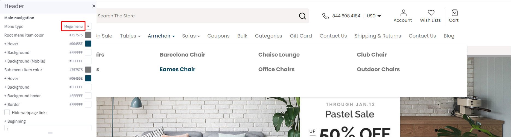

- `Dropdown`: show sub-menu item as dropdown style.

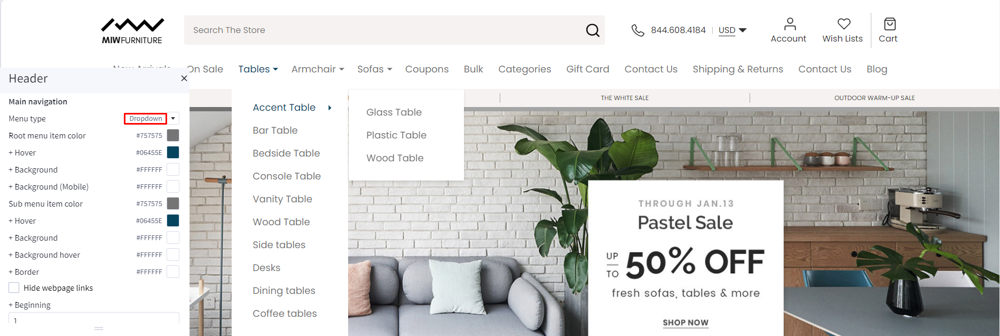

- `Column`: show sub-menu item as column style.


You can also hide or **Show web page links** and **Show widgets in the mega menu**.
#### Hide webpage links

To hide Webpage links such as **Contact us**, **About Us**, **Shipping and return** from header, in **Themes style** > **Header** Find **Hide Webpage links** option checked to hide all the links except **Categories** link.

If you only want to hide some specific links not all the link you can do following step:

- `+ Begining` field: input the order link you want to show.
- `+ Limit` field: input number web link you want to show after begining field.

For example: if you only want show **Theme Features** and **Shipping & Returns**:
- Begining field: 1;
- limit field:  2;

Note: the order will only count non-categories link.

Before


Affer:


### Main carousel

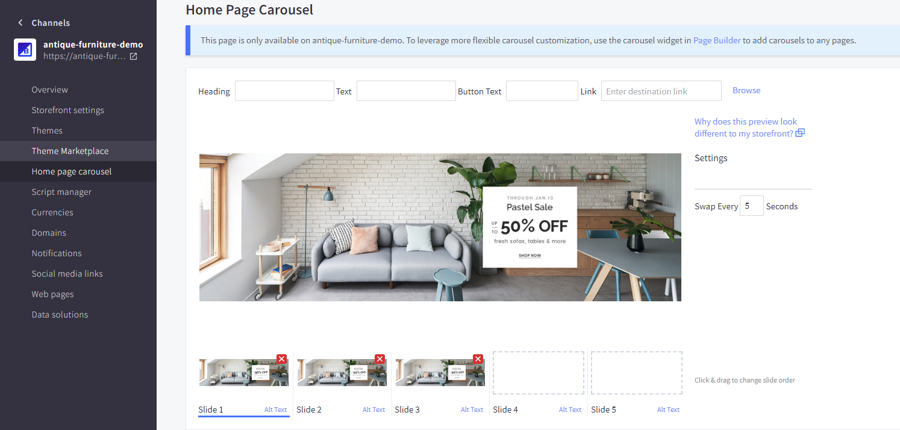

Upload the carousel images in **Storefront** > **Home Page Carousel**.

Go back to **Page Builder**, in **Theme Styles** > **Home Page**, make sure **Carousel** > **Show carousel** is selected, unchecked **Show top col** **Show left col** and **Show right col** . You can change the carousel styles and colors here.

#### Right column banner in homepage carousel


To display right banner in Main carousel.

Click on **Theme Styles** > **Home Page** > **Carousel** find show **right column** and enable it to open widget region.
 
Drag & drop layout widget from page builder to corresponding position in **right column**. Change column to 1. Set margin left and right = 0. Select column 1 and change padding left, right = 0.

drag & drop **Flex Banners | PapaThemes Chiara** widget to layout. Delete all banner **except banner 1**. In Banner click on **Image** and upload your image. Change image **width** = `485px` and **height** = `415px`. In General section, set all padding value `0` for all device.

Duplicate **Flex Banners | PapaThemes Chiara** widget. Select second banner change your **image** and **overlay image**.
### Categories

Desktop


Mobile


To create Categories : 

Drag & drop the **Layout widget** to the position **home below carousel**. Select the layout change column to 1 set column 1 with background color you want then change **layout name** = `CATEGORIES`.

Drag & drop **Flex Banners | PapaThemes Beautify**, to the layout delete all the items except the first one then change to your image change **width** = `178px` and **height** = `246px`. In general tab change padding set value **Desktop** = `20 10 20 10`, **Tablet** = `15 10 15 10`, **Mobile** = `15 15 15 15`.

On **Flex Banners | PapaThemes Beautify** choose setting. In general tab enable **Display banners in container div**, padding set value **Desktop** = `0 0 0 0`, **Tablet** = `0 30 0 30` and **Mobile** =`0 10 0 10`. In carousel tab, enable carousel and click on **setting**. In carousel setting , setup following **Items per slide** = `6`, **tablet** = `4` and **mobile** = `2`. Enable `show dot`.

Duplicate **banner 1** to quantity that you want and update your image for each banner.

### Special products tabs


You can configure special products tabs section settings in **Page Builder** > **Theme Styles** > **Home Page**, make sure one of the **Sections** field has **Special Products Tabs** selected.

In **New / Featured / Bestselling Tabs** section, Change **Number of products** = `5` and **Number of products load more on viewport** = `0`. You can change **Default tab** to `Featured`, `Bestselling` or `New`. **Display type** can be changed to `Carousel` or `Grid`. **Show more button**, **featured products**, **bestselling products**, **new products**, **categories** can be enabled by checked box.

### Bread
Desktop:


Mobile:


To create **Bread**:

Drag & drop Layout widget to the corresponding position, change **Column** = `1`, **Name** = `BREAD`.

Select **Column 1**, set **Padding** = `0 0 0 0`.

Drag & drop **Flex Banner| Papathemes Beautify** widget into **Column 1**. Delete all other banners except the first one.

Upload your image,set **Image width** = `1900px`, **Image height** = `920px`. Enable **Show different image on mobile**, upload your image in **Image (Mobile)**, set **Image width (Mobile)** = `610px`, **Image height (Mobile)** = `610px`.

In **General** > **Padding**, set `0` for all values.

In **Settings** of **Flex Banners| PapaThemes Beatify** > **General**, unchecked **Display banners in container div**.

### Product by category
Desktop

With **Left banner**:


With out **Left banner**:


Go to **Theme Styles** > **Home Page**, in the **Sections** field select **Product by category**.

To create **Left banner**:

Drag & drop the **Flex Banners | PapaThemes Beautify** widget to the corresponding position. Delete all other banners except the first one.

Upload your image in **Image** field. Set **Image Width** = `304px` and **Image Height** `466px`. You can change **Border radius** = `8px`.

If you want to show different image on mobile please enable **show different image on mobile** upload your image in **Image (Mobile)** field. Set **Image Width (Mobile)** = `401px` and **Image Height (Mobile)** = `295px`.

In **Content**, hide **Heading text** if your banner already has text.

In **General** > **Padding** panel, set `0` for all values and `24` for **bottom (Mobile)**.

Select the **Column 1** set padding = `0 0 0 0`.

To change **Border color of the title**:

In **Theme Styles** > **General** > **Link Colors** change color you want.

### Banner
Desktop :


To create **Banner** :

Drag & drop **Layout** widget to the corresponding position, change **Column** = 1, **Padding** = `0 0 0 0`

Drag & drop **Responsive | PapaThemes** widget into **Colum 1**. **SCREEN SIZE 1** select **Min** =`320px`, **Max** = `550px`, display = `Hide`. Apply set **Apply to** =`Only a layout or`, because of the use of the hidden **banner** feature on mobile devices, the **banner** will not be displayed when in mobile mode.

Drag & drop **Flex Banners | PapaThemes Beautify** widget into **Colum 1** below **Responsive** widget. Delete all other banners except the first one.

Upload your image, set **Image width** = `1170px`, **Image height** = `142px`.

In Settings of Flex Banners | PapaThemes Beautify > **General**, set **Padding** value **Desktop and Tablet** =`30 0 30 0`, **Mobile** =`0 0 0 0`.
### Bestselling products

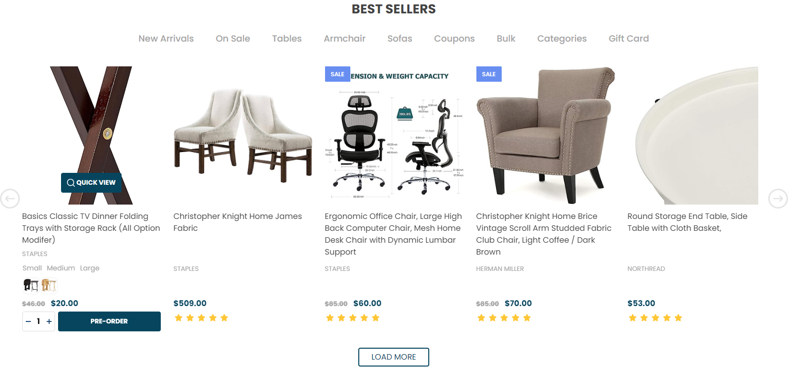

Bestselling products only display when your store has some order.

You can configure bestselling products section settings in **Page Builder** > **Theme Styles** > **Home Page**, make sure one of the **Sections** field has **Popular Products** selected. In **Best-sellers products** section, you can change the **Heading**, **Number of products** to display, Number of product per row (**Columns**), changing **Display type** to `Carousel` or `Grid`, changing the **background color**, editing the link of **View all products**.

### Customer Review


To create **Customer Reviews** : 

Drag & drop **Layout** widget to the corresponding position, change **Column** = `1`, set **Padding** = `0 0 0 0`.

Drag & drop **Customer Reviews | PapaThemes Beautify** widget into **Colum 1**. Delete all other **review** except the first one.

To edit **Review 1**, you can change the **Title**, **Content**, **Rating**, **Author** of **Review** to display, **Style for theme** select `Beautify Furniture`, unchecked **Display reviews in container div**.

Duplicate **review 1** to quantity that you want and update your image for each review.
### Featured products


You can set featured products in **Products**, click the **star** icon on the same row to set the product as featured.

Go back to **Page Builder** > **Theme Styles** > **Home Page**, make sure one of the **Sections** field has **Featured Products** selected. In **Featured products** section, you can change the **Heading**, **Number of products** to display, Number of product per row (**Columns**), changing **Display type** to `Carousel` or `Grid`, changing the **background color**, editing the link of **View all products**.
### Three Banners

Desktop :


Mobile : 


To create **Three Banners**:

In **Page Builder**, drag & drop **Layout** widget to the corresponding position. Change **Column** = `1`. Drag & drop **Flex Banners | PapaThemes Chiara** widget into **Column 1** and duplicate **Banner 1** to 3 banners.

To edit **Banner 1**, change your image, set **Image width** = `970`, **Image height** = `486`, select second banner change your image and overlay image.

In **General**, choose **Width** = `%`, set **Value (Desktop)** = `50%`, **Value (Tablet)** = `100%`, **Value (Mobile)** = `100%`. Set **Padding** for **Desktop** = `0 30 0 0`, **Tablet** = `0 0 15 0`, **Mobile** = `0 0 15 0`.


To edit **Banner 2**, change your image, set **Image width** = `530px`, **Image height** = `530px`.

In **General**, choose **Width** = `%`, set **Value (Desktop)** = `25%`, **Value (Tablet)** = `50%`, **Value (Mobile)** = `100%`. Set **Padding** for **Desktop** = `0 15 0 0`, **Tablet** = `0 8 15 0`, **Mobile** = `0 0 15 0`.

Set values for **Banner 3** as the same **Banner 2**. In **General** of **Banner 3**, set **Padding** for **Desktop** = `0 0 0 15`, **Tablet** = `0 0 0 8`, **Mobile** = `0 0 0 0`.

### New products


You can configure new products section settings in **Page Builder** > **Theme Styles** > **Home Page**, make sure one of the **Sections** field has **New Products** selected. In **New products** section, you can change the **Heading**, **Number of products** to display, Number of product per row (**Columns**), changing **Display type** to `Carousel` or `Grid`, changing the **background color**, editing the link of **View all products**.
### Recent blog posts

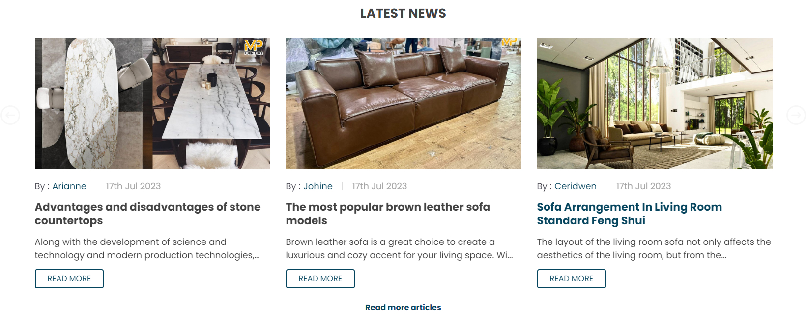

You can add blog posts in Storefront > Blog. Click the **+** button to add a new blog post. Make sure **Blog Visibility** is `on`.

To display the recent blog posts on the home page, go to Page Builder. In Theme Styles > Home Page, make sure one of Sections has **Recent Blog** selected. Scroll down the Recent Blog section, you can configure **Heading**, **Number of posts** to display.
### Instagram photos

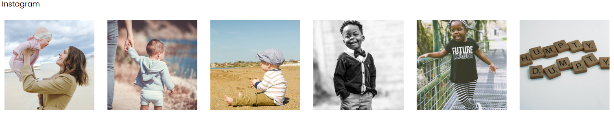

To display your Instagram photos, open <https://instagram.papathemes.com/> Follow the instruction on this page to [Connect your Facebook Page with your Instagram account](https://www.facebook.com/business/help/898752960195806). Then click **Login With Facebook** button and follow the further steps to authorize access permission. Click **Show Embedding Code** button to generate the code embedding to your web store. Choose **Preset** = `Carousel` and select **LazyLoad**.

Copy all the code appear in Step 1 & Step 2. For example:

```html
<script>!function(){var a=document.createElement("script");a.defer=!0,a.src="https://papathemes.s3.amazonaws.com/instagramapp/assets/js/embed-1.0.1.js",a.onload=function(){PapathemesInstagramApp.init({account_id:"****************",element_id:"papainstagram-render",limit:"20",preset:"grid",lazyload:"false"})},document.body.appendChild(a)}();</script>

<div id="papainstagram-render"></div>
```

Go back to your store Page Builder. Drag & drop the HTML widget to the corresponding position. Paste the generated code above to the HTML editor, and click **Save HTML** button. Your Instagram photos should display like our demo store.

Please note that the app only updates your latest uploaded photos every 6 hours.

To create the title, drag & drop the **Section Heading** widget to above the Instagram photos. Set **Padding** = `30 0 30 0` and **Padding (Mobile)** = `15 0 15 0`.

Drag & drop the **Spacer | Papathemes Beautify** widget into Column 1 below HTML. Set value **Desktop** = `70px`, **Tablet** and **Mobile** = `30px`

### Footer Newsletter


Show Newsletter in footer, in **Theme Styles** > **Footer** > **Newsletter** section, select Style = **In Footer**. Select **Show store logo** and **Show social icons** = **In newsletter**. Make sure **Show newsletter form** is selected. You can change the **Heading**, **background color**, **background image**, **button and text colors**.

In **Page Builder** > **Theme Styles** > **Footer**, configure the footer link colors in **Main Footer** section, displaying store logo, contact info, store address,... **Show pages** allows to limit number of web page links to display. **Show categories** allows to limit number of category links to display. Similarly for **Show brands** option.

**Payment Icons** allows to select which payment icons to display.

**Copyright** allows to configure the copyright text.

### Display custom footer links

In **Page builder** > **Custom Widget** find **Footer links | PapaThemes Beautify** widget then Drag & drop the widget to corresponding position in Footer.

Select the **Column 1** and change **padding** to `0`

In **design** you can type your link content and click on the **insert/edit link** button as picture below:


In the popup window, copy your web link to `URL`. On the **Open links..** field you can select how your link could be open in **New Window** or **Current Window**


## Setting Up Furniture Style Home Page
### General

You can read these common instructions in **Setting Up Pets Style Home Page** chapter:

- [Header](#header)
- [Special products tabs](#special-products-tabs)
- [Bestselling products](#bestselling-products)
- [Featured products](#featured-products)
- [New products](#new-products)
- [Product by category](#product-by-category)
- [Recent blog posts](#recent-blog-posts)
- [Instagram photos](#instagram-photos)

### Slider Menu


To create **Slider Menu**:

Drag and drop **HTML** widget to the correspoding position.
 
Select **Column 1**, set Padding = `0 0 0 0`.

Select **Layout** with **Name** = `SLIDER_MENU`, set **Layout Background**  to a certain color that you want.

Paste the given code below to the HTML editor, then click Save HTML button.

```html
<div class="list-ctgry">
      <a href="#" class="item-ctgry">
         GAME DAY FURNITURE SALE
      </a>
      <a href="#" class="item-ctgry">
        THE ENTRYWAY SALE
       </a>
      <a href="#" class="item-ctgry">
        THE WHITE SALE
      </a>
      <a href="#" class="item-ctgry">
        OUTDOOR WARM-UP SALE
      </a>
        <a href="#" class="item-ctgry">
           GAME DAY FURNITURE SALE
        </a>
      <a href="#" class="item-ctgry">
        THE ENTRYWAY SALE
       </a>
      <a href="#" class="item-ctgry">
        THE WHITE SALE
      </a>
      <a href="#" class="item-ctgry">
        OUTDOOR WARM-UP SALE
      </a>
      <a href="#" class="item-ctgry">
         GAME DAY FURNITURE SALE
      </a>
      <a href="#" class="item-ctgry">
        THE ENTRYWAY SALE
     </a>
      <a href="#" class="item-ctgry">
        THE WHITE SALE
      </a>
      <a href="#" class="item-ctgry">
        OUTDOOR WARM-UP SALE
      </a>
  </div>
```

### Main carousel
#### Stretch banner in homepage carousel


Choose **Carousel** > **Style** = `Stretched`, **Button style** = `Outline`, **Indicator** = `#E7E7E7`, **Indicator Active** = `#06455E`, unchecked **Show top col**, **Show left col** and **Show right col**


### Featured

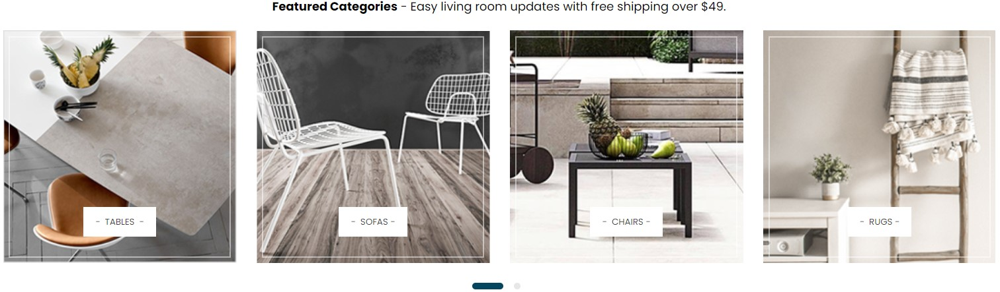

To create **FEATURED**: 

Drag & drop **Layout** widget to the corresponding position, change **Column** = `1`. Select **Column 1**, set **Padding** = `0 0 0 0`.

Drag & drop **Section Heading | PapaThemes Beautify** widget into **Column 1**. Typing your text (example "**Featured Categories** - Easy living room updates with free ship over $49"), select custom in **Text style** field, set **Font size** and **Font size (Mobile)** = `18px`, **Text color** = `#000000`, set **Padding** = `0 0 0 0`.

Drag & drop **Flex Banners | PapaThemes Beautify** widget to layout. Delete all banner **except banner 1**. 

Upload your image, set **Image width** = `375px`, **Image height** = `375px`. If you want to show different image on mobile please enable **Show different image on mobile** upload your image in **Image (Mobile)** field.

In **Content** set **Content Padding** = `0 0 40 0`, **Content padding (Tablet)**  = `0 0 25 0`, **Content padding (Mobile)** = `0 0 22 0`.

Tick active **Action button** . Choose **Style** = `Custom`, **Radius** = `0px`, **Color** = `#FFFFFF`, **Color hover** = `#06455E`, **Text color** = `#3F3F3F`, **Text color hover** = `#FFFFFF`.

In **General**, choose **Width** = `%`, set value **Desktop** = `25%`, **Tablet** = `33,33%`, **Mobile** = `50%`.

Set **Padding** value **Desktop** = ` 25 15 25 15`, **Tablet** and **Mobile** = `15 10 15 10`.

Duplicate **banner 1** to quantity that you want and update your image for each banner.

In **Settings** :

Choose **General**, **Style for theme** = `Beautify Furniture`, unchecked `Display banners in container div`

Choose **Carousel**, show **Enable carousel**, in **Carousel settings** panel set value **Items per slide** = `4`, **Items per slide (Tablet)** = `4`, **Items per slide (Mobile)** = `2`, unchecked **Show arrows**.
### Category Banner


Drag & drop **Section Heading | Papathemes Beautify**. Select the layout change column to 1 and change **layout name** = `BOXED`. Typing your text(example "Help yourself to a stylish dining room"), select custom in **Text style** field, **Text style** = `Custom`, **Font weight** = `Semi Bold`, **Font size** and **Font size(Mobile)** = `18px`. Set value **Padding** = `46 0 25 0`, **Padding(Mobile)** = `16 0 18 0`.

To create **Category Banner**

Drag & drop **Layout** widget to the corresponding position, **Columns** = `2`. **Column layout** with a ratio of `4/12`.

**Column 1** :

Drag & drop **Spacer** = `25px`.

Drag & drop **Section Heading | Papathemes Beautify** :

**Text style** = `Custom`, **Font weight** = `Normal`, **Font size** and **Font size(Mobile)** = `15px`, set value **Padding** = `0 25 20 25`, **Padding(Mobile)** = `0 25 18 25`

Drag & drop **Button** : 

In **Button**, set **Padding** = `5 5 5 5`. 

In **Text**, set **Font size** = `12px`, **Text color** = `#000000` and **Text color(hover)** = `#ffffff`.

**Column 2** :

Drag & drop **Flex Banners | Papathemes Beautify** to the layout delete all the items except the first one then change to your image change **width** = `1000px` and **height** = `368px`. In **Settings** unchecked **Display banners in container div**

The rest remains the same, only the position is changed.
### Double Banner

Desktop :


Mobile : 


To create **Double Banner**

Drag & drop **Layout** widget to the corresponding position, change **Column** = `1`, **Name** = `BOXED`, set **Padding** = `0 0 0 0`.

Drag & drop **Flex Banners | PapaThemes Beautify** widget into **Column 1**. Delete all other banners except the first one.

Upload your image, set **Image width** = `737px`, **Image height** = `147px`. If you want to show different image on mobile please enable **Show different image on mobile** upload your image in **Image (Mobile)** field.

Duplicate to 2 banners and upload images according to each banner.

Set **Padding** value **Desktop** = `0 16 0 0`, **Tablet** and **Mobile** = `0 0 20 0`.

In **Settings** of **Flex Banners | PapaThemes Beautify** > **General**, choose **Width** = `%`, set value **Desktop** = `50%`, **Tablet** and **Mobile** = `100%`, unchecked `Diplay banners in container div`.


### Brand


To create **Brand**:

Drag & drop **Layout** widget to the corresponding position, change **Column** = `1`, **Name** = `BRAND`.

Select **Column 1**, set **Padding** = `0 0 0 0`.

Drag & drop **Section Heading | PapaThemes Beautify** widget into **Column 1** :

Typing your text (example "We Carry Top Brands"), select custom in **Text style** field, **Text style** = `Custom`, **Font weight** = `Semi Bold`, **Font size** and **Font size(Mobile)** = `18px`.

Drag & drop **Flex Banners | PapaThemes Beautify** widget to layout. Delete all banner except **banner 1**.

Upload your image, set **Image width** = `278px`, **Image height** = `96px`. If you want to show different image on mobile please enable **Show different image on mobile** upload your image in **Image (Mobile)** field.

Duplicate **banner 1** to quantity that you want and update your image for each banner.

In **general**, choose **Width** = `%`, set **Value(Desktop)** = `20%`, **Value (Tablet)** = `33,333333%`, **Value (Mobile)** = `50%`. Set **Padding** for **Desktop** = `20 12 20 12`, **Tablet** and **Mobile** = `15 10 15 10`. Uncheck **Display banners in container div**

In **carousel**, show **enable carousel** and click on setting **Items per slide** = `5`, **Items per slide (Tablet)** = `3` and **Items per slide (Mobile)** = `2`. Enable **show dots**.

### Slider Category


To create **Slider Category**

Drag & drop **Layout** widget to the corresponding position, change **Column** = `1`, **Name** = `SLIDER_CATEGORY`, **Padding** = `0 0 40 0`.

Select **Column 1**, set **Padding** = `0 0 0 0`.

Drag & drop **Flex Banners | PapaThemes Beautify** widget to layout. Delete all banner except **banner 1**.

Upload your image, set **Image width** = `432px`,**Image height** = `58px`. If you want to show different image on mobile please enable **Show different image on mobile** upload your image in **Image (Mobile)** field.

In **Content** set value **padding** = `0 0 0 0`.

Turn on **Heading text** : 

**Text style** = `Custom`, **font weight** = `Semi Bold(Demi Bold)`, **font size** and **font size (Mobile)** = `13px`, **text color** = `#000000`,
**text color hover** = `#003366`, **text color (Mobile)** = `#000000` and **text color hover(Mobile)** = `#003366`

Turn on **Description text** : 

**Description style** = `Custom`, **font weight** = `Normal`, **font size** and **font size (Mobile)** = `11px`, **Text color**, **Text color hover**,
**Text color(Mobile)** and **Text color hover (Mobile)** = `#000000`.

In **General** :

Choose **Width** = `%`, set **Value (Desktop)** = `25%`, **Value (Tablet)** = `33,3333%`, **Value (Mobile)** = `50%`.

Set **Padding** for **Desktop and Tablet** = `10 10 10 10`, **Mobile** = `10 5 10 5`.

Duplicate banner 1 to quantity that you want and update your image for each banner.

In **Settings**, **Style for theme** = `Kansha Sport`, unchecked `Display banners in container div`.

Choose **Carousel** turn on **Enable Carousel**. In carousel setting, **Items per slide** and **Items per slide (Tablet)** = `4`, **Items per slider (Mobile)** = `2`, unchecked **Show arrows**

### Live Help


To create **Live Help** : 

Drag & drop **Layout** widget to the corresponding position, change **Column** = `1`, **Name** = `BOXED`, **Padding** = `0 0 0 0`.

Drag & drop **Divider**, select **Line color** = `#DEDEDE`, **Line thickness** = `3px`.

Drag & drop **Layout** widget to the corresponding position, change **Column** = `2`, **Name** = `BOXED`, **Padding** = `0 0 0 0`, Column layout with a ratio of `9/12`.

**Column 1** :

Drag & drop **Text**, set **Text style** = `Custom`, **Font weight** = `Medium`, **Font size** = `14px`, **Text color** = `#333333`

**Column 2** : 

Drag & drop **Button**, choose **Button** set value **Padding** = `7 21 7 21`, choose **Text** set **Font size** = `14px`.

Choose **Style** set **Button color** = `#06455E`,
**Button color (hover)** = `#003366`, **Border color** and  **Border color (hover)** = `No Color`, **Border thickness** and **Border radius** = `0px` 

### Contact


To create **Contact** :

Drag & drop **Layout** widget below **Live Help**, change **Column** = `1`, **Name** = `CONTACT`, **Padding** = `0 0 0 0`.

Drag & drop **Callout Icons | Papathemes Beautify** widget to layout. Delete all callout except **callout 1**.

**Style** = `Large`, choose **Width** = `%`, set **Value (Desktop)** = `25%`, **Value (Tablet)** = `50%`, **Value (Mobile)** = `100%`. Set all padding value `30 16 30 16` for all device.

Select **Icon** = `Choose Image`, **Text style** = `Custom`, **Font weight** = `Semi Bold(Demi Bold)`, **Font size** and **Font size (Mobile)** = `15px`, **Text color** and **Text color hover** = `#000000`.

Tick active **Show second text**, select **Second text style** = `Custom`, **Font size** and **Font size (Mobile)** = `13px`, **Text color** and **Text color hover** = `#000000`. Unchecked **Display icons in container div**.

Duplicate Callout 1 to 4 callout.

### Newsletter


To create **Newsletter** : 

To enable newsletter form, go to **Marketing** > **Email Marketing**, make sure **Allow Newsletter Subscriptions** is checked. Optionally select **Show Newsletter Summary** and enter the summary text as you want.

Go to Page Builder, in **Theme Styles > Footer > Newsletter** section, select **Style** = `Default`. Select **Show store logo** and **Show social icons** = `In newsletter`. Make sure **Show newsletter form** is selected. You can change the **Heading, background color, background image, button** and **text colors**.


### Footer


In **Page Builder** > **Theme Styles** > **Footer**, you can configure the newsletter form appearance in **Newsletter** section, configure the footer link colors in **Main Footer** section, displaying store logo, contact info, store address,... **Show pages** allows to limit number of web page links to display. **Show categories** allows to limit number of category links to display. Similarly for **Show brands** option.

**Payment Icons** allows to select which payment icons to display.

**Copyright** allows to configure the copyright text.
## Customizing Products Display

### Product Card

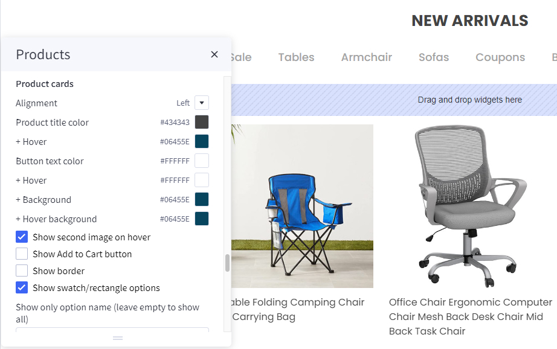

Configuring product cards in **Page Builder** > **Theme Styles** > **Products** > **Product cards**.

- **Alignment**: Specifying content alignment `left` or `center`.
- **Product title color**: Specifying the product name's color.
- + **Hover**: Specifying color when hover or focus.
- **Button text color**: Specifying the button text color.
- + **Background**: Specifying the button background color.
- + **Border**: Specifying the button border color.
- **Show second image on hover**: Displaying the second image when hover the product card.
- **Show border**: toggle displaying the product card border.
- **Show swatch/rectangle options**: Allows to display with swatch/rectangle type product option on every product card. It's helpful to display different product variants like colors or sizes.
- **Swatch sizes**: Specifying the swatch color/image size.
- **Badge position**: also to configure the sale badge position to `Top Left` or `Below image`.

### Displaying product price ranges

By default product price ranges is enabled. To turn off, Go to **Page Builder** > **Theme Styles** > **Products** > uncheck **Price ranges** checkbox.

**Show retail price**: Toggle displaying the product retail prices.


### Hiding prices for non logged in customers

To turn on this feature, go to **Page Builder** > **Theme Styles** > **Products** > tick **Restrict Purchase to Login** checkbox.

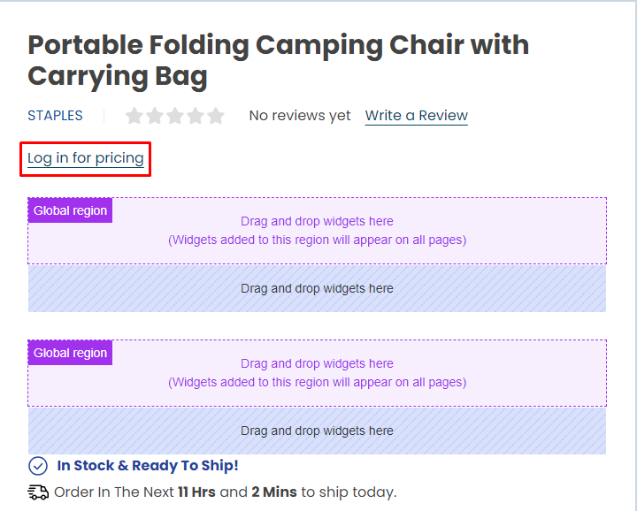

### Redirecting to cart page after product added to cart

By default the cart popup is displayed, if you want to take customer to the cart page instead, go to **Page Builder** > **Theme Styles** > **Products** > tick **Redirect to cart page after add to cart** checkbox.

### Showing/Hiding Quick-View button

By default quick-view buttons appear on all product cards. To hide it, go to **Page Builder** > **Theme Styles** > **Products** > un-tick **Show Quickview** checkbox.

### Showing/Hiding the quantity box on PDP

By default the quantity box shows up, to hide it, go to **Page Builder** > **Theme Styles** > **Products** > un-tick **Show quantity selection on product pages** checkbox.

### Customizing the popup displayed after product added to cart

In **Page Builder** > **Theme Styles** > **Products** > **Popup after added to cart**:

- `Default`: Displaying the large popup.
- `Mini`: Displaying a smaller popup that has auto close.
- `Cart Preview`: Displaying the whole shopping cart popup on the right side.
- `Hide`: Not show any popup.

Mini added to cart popup:


### Displaying Recently Viewed Products

Recently viewed products only display for logged-in customers.

To enable it, go to **Page Builder** > **Theme Styles** > **Products** > **Show recently viewed** select number of products to display.


### Customizing Price Labels

You can customize sale price label, before sale price label, retail price label or regular price label in 
**Page Builder** > **Theme Styles** > **Products** > **Price Labels**


### Displaying product weight, dimensions on PDP

Go to **Page Builder** > **Theme Styles** > **Products** > **Product Page**.

- Tick **Show product weight** checkbox.
- Tick **Show product dimensions** checkbox.

### Display sale badge / in-stock badge on PDP

Go to **Page Builder** > **Theme Styles** > **Products** > **Product Page**.

- Tick **Show sale badge** checkbox.
- Tick **Show in-stock badge** checkbox.

### Displaying Image gallery 

#### Image Gallery Position

In **Page Builder** > **Theme Styles** > **Products** > **Product Page**, In **Image gallery position** , select `Left` or `Right` to change Image gallery position .

- `Right`


#### Displaying sub-image as a slider

In **Page Builder** > **Theme Styles** > **Products** > **Product Page**, **Enable thumbnail carousel** section, you can change display thumbnail images to slider or grid.

- `1 row`: Sub-images are displayed in the slider on 1 row.

- `2 rows`: Sub-images are displayed in the slider on 2 row.

- `Hide`: All sub-images are displayed as grid.


#### Displaying product image thumbnails vertically

In **Page Builder** > **Theme Styles** > **Products** > **Product Page**, checked **Show image thumbnails vertically** to display product thumbnails vertically, otherwise it's displayed horizontally.

Checked **Show image thumbnails vertically**:


### Displaying product bulk pricing inline in table

Instead of displaying bulk pricing in a popup modal, you can display it inline by going to **Page Builder** > **Theme Styles** > **Products** > **Product Page**, tick **Show bulk price as table**.


### Displaying sticky Add to Cart button on PDP on mobile

In **Page Builder** > **Theme Styles** > **Products** > **Product Page**, tick **
Show sticky Add to Cart on mobile**.

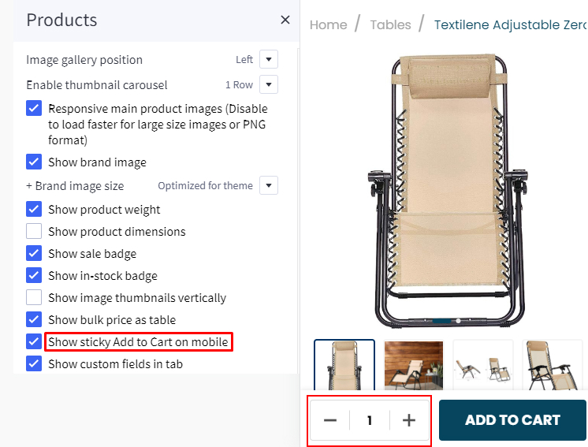

### Displaying product custom fields in a separated tab

In **Page Builder** > **Theme Styles** > **Products** > **Product Page**:

- Tick **Show custom fields in tab** checkbox.
- Enter the tab title in the next **Tab title** box.


### Custom tabs


To add the custom tabs and product pages, edit your product description, click on HTML button to open HTML Source Editor:


Use the editor in the [link](https://bc-supermarket-docs.papathemes.com/customization/product-page#custom-tabs) to generate HTML for your custom tabs. Click Export HTML button, copy & paste the generated HTML at the end of HTML Source Editor.

### Displaying Delivery & Returns tab

In **Page Builder** > **Theme Styles** > **Products** > **Product Page**:

- Tick **Show Delivery & Returns tab** checkbox.
- Enter the tab title in the next **Tab title** box.

You can add specific content or global content using BC widgets:


### Numbers of products, reviews, thumbnails

In **Page Builder** > **Theme Styles** > **Products** > **Product Page**:

- **Number of Product Reviews**: Specifying number of product reviews displayed.
- **Number of Related Products**: Specifying number of related products displayed.
- **Number of Customers Also Viewed Products**: Specifying number of customer also viewed products displayed.
- **Number of visible thumbnails**: Specifying number of images displayed in the product thumbnails slider.


### Displaying Swatch Options in the dropdown select box

In **Page Builder** > **Theme Styles** > **Products** > **Swatch display type**:

- Default (Square): Displaying the regular swatches by default.
- Dropdown: Displaying swatches in the dropdown select box.
- Dropdown + Square: Displaying swatches in the dropdown select box in addition to regular swatches.


### Displaying Frequently Bought Together Products


Enabling this feature in **Page Builder** > **Theme Styles** > **Products** > **Frequently Bought Together**, Select **Position** to display it.

- **Load products from**: Specifing products to display here.
  - `Custom fields __alsobought`: Specifying the relevant products in product custom fields with name `__alsobought` and value is the relevant product ID. For example:
  
  - `Related products`: Pulling from the related products.
  - `Similar by biews`: Pulling from customer also viewed products.
- **Auto select all items**: Auto select or unselect all frequently bought together products.
- **Thumbnail size**: Specifying the thumbnail image size.
### Configuring swatch dimension

In **Page Builder** > **Theme Styles** > **Products** > **Swatch display type** > Set **Swatch size**.


### Sale badge, Condition badge and custom text badges


Displaying the sale badge in **Page Builder** > **Theme Styles** > **Products** > **Product sale badges**, tick **Show sale badges**.

- **Label**: Specifying the badge text.
- **Text color**: Specifying the badge text color.
- **Background color**: Specifying the badge background color

Displaying the condition badge in **Custom badges**, tick **Enable custom badge from '__badge' custom field**. Edit product, add custom field with name `__badge` and value is the badge text.

- **Text color**: Specifying the text color of the custom badge.
- **Background color**: Specifying the background color of the custom badge.

### Configuring image sizes


In **Page Builder** > **Theme Styles** > **Products** > **Image Sizes**:

- Main product images: Specifying the main product image size displayed on PDP.
- Thumbnail image: Specifying the product thumbnail size.
- Zoomed image: Specifying the zoomed image size.
- Image in gallery view: Specifying product card image size.

### Shipping countdown


To enable shipping countdown, **Theme styles** > **Product page**  find **shipping countdown** field and input your cut off time. Find and copied your timezone from wikipedia `https://en.wikipedia.org/wiki/List_of_tz_database_time_zones` to **timezone** field.

Note: The time before cut off the message will show **shipping today** after cut off the message will show **shipping tomorrow**

### Flash sales


To create flash sales bar for each product, in **product** select the product that you want to add flash sale bar. 

Find customer fields, click on add **Add Custom Field**. Copy `__countdown_label` and paste into **Custom Field Name**. In **Custom Field Value**, type your content following format: `<your banner name>|<end in>` (example: FLASH SALES|ENDS IN). 

Create another custom field, Copy `__countdown_date` and paste into **Custom Field Name**. In **Custom Field Value**, enter your cut off time following the format: `<yyyy>-<mm>-<dd> <hh>:<mm>:<ss><timezone>` (example: 2023-03-15 17:00:00-7).

Note:

- `<yyyy>-<mm>-<dd>` is optional. If the date is not entered, the banner will repeat automatically right after pass cut off time.
  
- `<hh>:<mm>:<ss>` is 24 hour format.
  
- `<timezone>` only input `+ or -` and `number` example: `+7`. if timezone are not entered, the countdown time will be different in different countries.
### Brand logo in product detail


To display **Brand logo** in product detail, in **Page Builder** > **Products** > **Product Page** find and check **Show brand image** option.


### Ask question

In **Page Builder** > **Theme Styles** > **Products** > **Product Page** find **Ask question (contact page URL)** and enter `/contact-us/` to display **Ask Questions?**.


### Nutrients & Directions


To create additional information link:

In **Storefront** > **Web Pages**, click on the **Create a Web Page** button to create new webpage.

In **Web Page Details**, enter your page name in **Page Name** field, **Page URL** will be automatically generated. In **Page content** field enter your content.

Uncheck **Navigation Menu** options.

In **Advanced Options** set **Sort Order** = `2`.

To display the additional information link in the product detail page:

In **Products**, select the product you want to display the link. Find **Custom Fields**, created new custom field. Set **Custom Fields Name** = `__guide_popup` and **Custom Fields Value** = `<your page name>|<Page URL>` (example: `Nutrients & Directions|/nutrients-directions/`) then save.

**Watch the instruction video:**

(wait a resource)


### Video image product detail page

In **Page Builder** > **Theme Styles** > **Products** > **Product Page** find **Show videos** select `tab` or `image gallery` to change display video position.

Videos displayed in **tab** options:

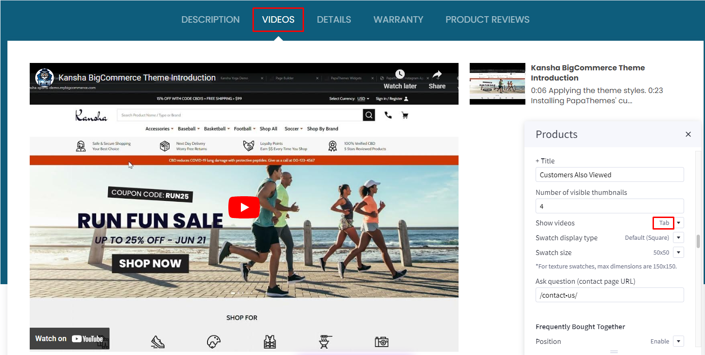

Videos displayed in **image gallery** option:


## Customizing Category Pages

Configuring the category pages in **Page Builder** > **Theme Styles** > **Products** > **Category Page**.

### Category Layout Type

Theme supports displaying category Page layout in `Full width` mode or `Left sidebar` mode. In **Layout**, select the particular display mode for default display.

- **Layout** = `Full width`

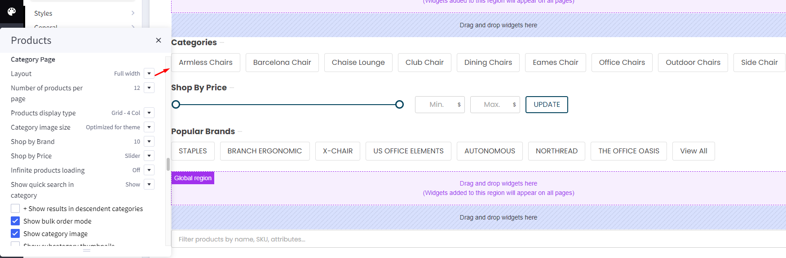

- **Layout** = `Left sidebar`
 


### Products Display Type

Theme supports displaying products in grid mode (2, 3, 4 or 6 products per row), in list mode or bulk order mode. In **Products display type**, select the particular display mode for default display.

- **Display type** on the right allow your customers to change product category display by themselves.


**Grid 6 columns:**

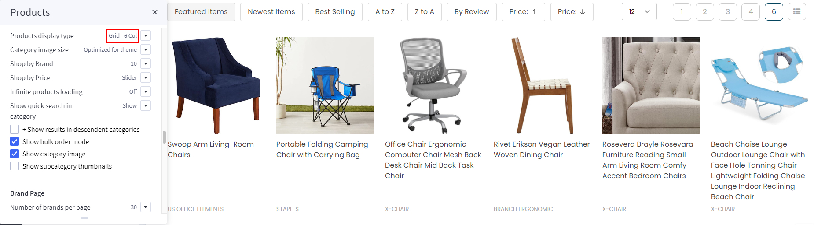

**List mode:**


### Display Bulk Order layout

To display this bulk order layout, select **Products display type** = `Bulk order`.


### Displaying Shop by Brand

- **Shop by Brand**: Specifying number of popular brands to display.

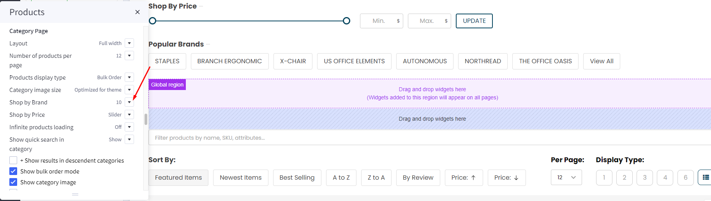

### Displaying Price Slider

- **Shop by Price**:
  - `Slider`: Displaying the price slider.
  - `List`: Displaying price list.
  - `Hide`.

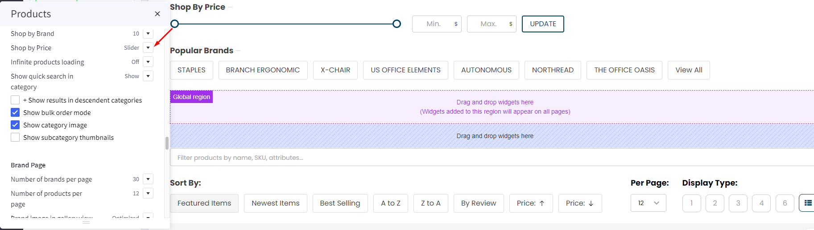

### Infinite Products Loading

This feature allows you to choose the method of loading more products in the current catalog.


**Infinite Products Loading**:

  - `On scroll`: Products will automatic loadout when scrolling down.

  - `Load more button`: Click on the **Load more button** to continue loading more products.

  - `Off`: Show **page numbers** and **arrow** button as original. Click on button to see more products.

### Display contextual search

This feature allows searching products within the current category and the current selected filter.


Select **Show quick search in category** = `Show` to enable it.

- **+ Show results in descendent categories**: if selected, it also displays results in the descendent categories.

### Display subcategory image thumbnails

This feature allow displaying subcategory thumbnails before products.

Select **Show subcategory thumbnails** to enable it.


### Common Settings

- **Number of products per page**: Specifying number of products to display per page.
- **Show category image**: Displaying the category image or not.
- **Show category description on AMP page**: Displaying category description on AMP category page or not. If the category content contains images, the AMP page could be invalid. It's recommended to turn off this option.

## Customizing Brand Page & Search Page

Configuring the brand page in **Page Builder** > **Theme Styles** > **Products** > **Brand Page**.

- **Number of brands per page**: Specifying number of brands to display per page.
- **Number of products per page**: Specifying number of products to display per page.
- **Brand image in gallery view**: Specifying the brand card image size.
- **Brand image in brand page**: Specifying the large image size displayed on the brand page.

Configuring the search results page in **Page Builder** > **Theme Styles** > **Products** > **Search results**.

- **Number of products per page**: Specifying number of products to display on the search results page.

### Displaying brand quick-view introduction


In **Marketing** > **Marketing Banner**, click **Create a Banner** button. 

- Enter the brand introduction content to **Banner Content**.
- Select **Show on Page** = `For a Specific Brand` and select the corresponding brand.
- Select **Location** = `Bottom of Page`.
- Then click **Save** button to finish.

